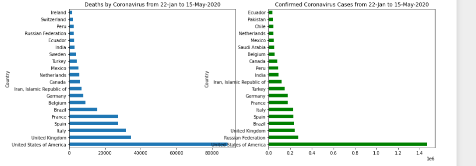
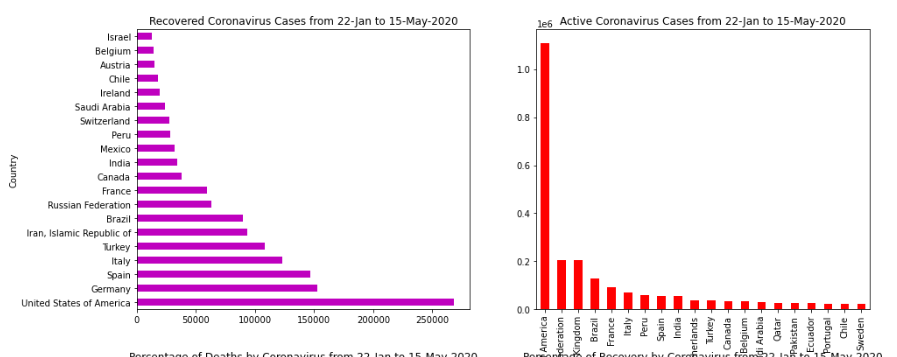
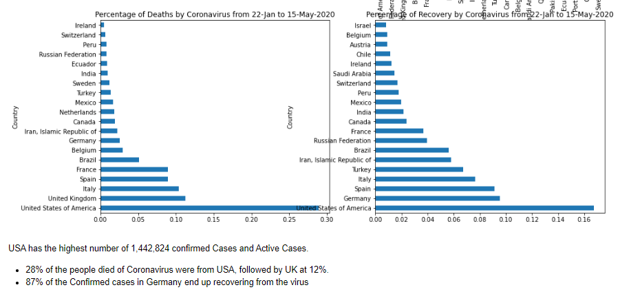
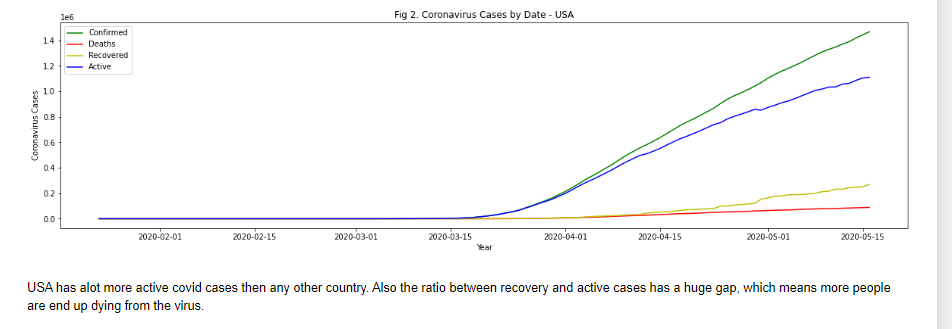
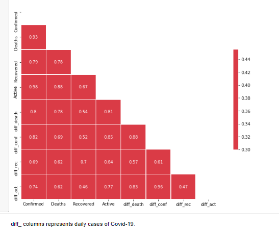

# Data Science Covid 19 Analysis: Project Overview
This project extract the data from API to analyse and predict Corona virus cases around the world. For Analysis,I was able to  extract all the corona virus cases around the world from 22 January to 15 may 2020. 

1 - Extracting the data using **Rest API** method  

2 - Load the data on to **Oracle SQL**, which allows data to connect with Tableau server. 

3 - Carried out **EDA** on covid cases and found some meaningful insights.

4 - Created a **Dashboard** inside **Tableau** that allows users to explore the covid cases around the world.

5 - Prediction not completed yet.

# 1. Python REST API to Extract the data 

Python Version: 3.7

Packages: pandas, requests, datetime and json

Data/API Source -  https://documenter.getpostman.com/view/10808728/SzS8rjbc?version=latest

I was able to connect through API using the requests library without any authentication and then used json library to convert the data into DataFrame. 

#  2. Oracle SQL (ETL)

For the Tableau Dashboard, I was able to load the DataFrame onto Oracle SQL as most of the project at my work start with manipulating the data inside SQL.

Packages: Pandas and cx_Oracle

Step 1 : Make connection with Oracle SQL

Step 2 : Create a new Table

Step 3 : Insert values into the table

**Potential  Next Step** could be to setup the ETL pipeline on AWS to extract the data daily - I will not be doing that step for this project.

# 3. EDA - Python

After Extracting the data, I needed to clean it up so that it was usable for Analysis. I made the following changes and created the following variables:

- Transformed founded ISO date to Standard dates 

- Added new column for daily confirm,active,recovery and death cases. 

 

# 4. Tableau (Public)

This second part of the project was to create a Dashboard on Tableau, which allows users to interact with the dashboard and explore the cases around the world.

Link 1 - https://public.tableau.com/profile/jas2719#!/vizhome/WorldCovid19_15897354026970/Dashboard1

Link 2 - https://public.tableau.com/profile/jas2719#!/vizhome/WorldCovid19_15897354026970/Dashboard2

Link 3 - https://public.tableau.com/profile/jas2719#!/vizhome/WorldCovid19_15897354026970/WorldMap

Link 4 - https://public.tableau.com/profile/jas2719#!/vizhome/WorldCovid19_15897354026970/CasesbyCountry
