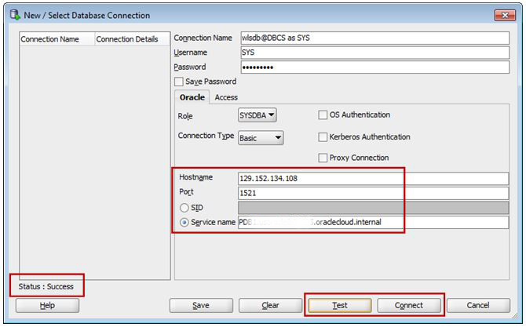
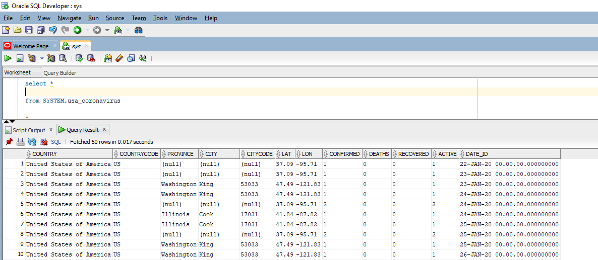
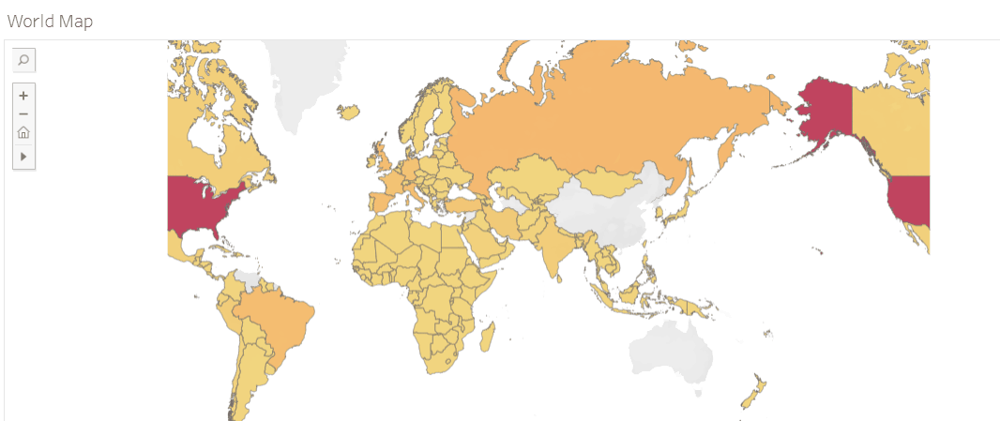
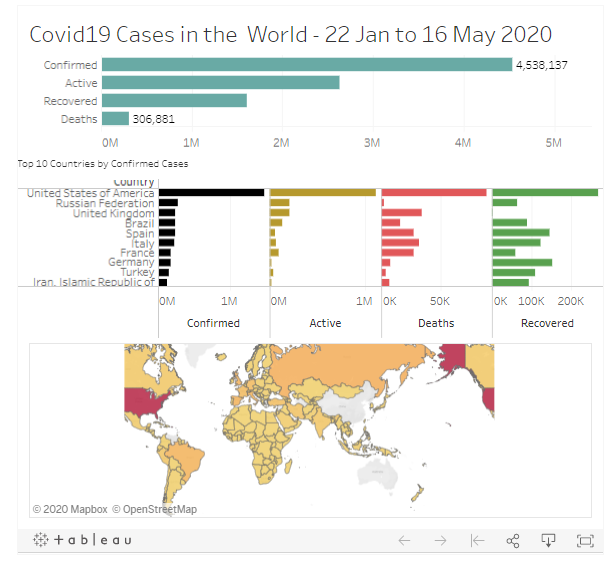
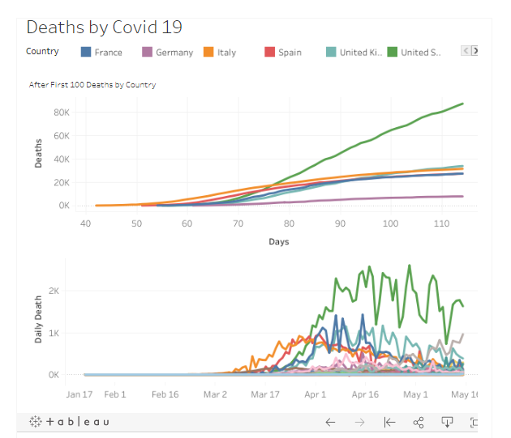

# Data Science Covid 19 Analysis: Project Overview
This Project Extract the data from API to Analysis and Predict Corona virus Cases around the world.

# Python REST API to Extract the data 

Python Version: 3.7

Packages: pandas, requests, datetime and json

Data/API Source -  https://documenter.getpostman.com/view/10808728/SzS8rjbc?version=latest

I was able to connect through API using the requests library without any authentication and used json library to convert the data into DataFrame. 

# Oracle SQL (ETL)

For the Tabelau Dashboard, I wanted to Load the DataFrame onto Oracle SQL as most of the project at my job start with manpuilate the data inside SQL.

Packages: Pandas and cx_Oracle

Step 1 : Make connection with Oracle SQL

Step 2 : Create a new Table

Step 3 : Insert values into the table

**Proteinal Next Step** could be to setup the ETL pipeline on AWS to extract the data daily - I will not be doing that step for this project.

# EDA - Python

After Extracting the data, I needed to clean it up so that it was usable for Analysis. I made the following changes and created the following variables:

- Transformed founded ISO date to Standard dates 

- Added new column for daily confirm,active,recovery and death cases. 

# Tabelau (Public)

This second part of the project was to create a Dashboard on Tabelau, which allows users to interact with the Dashboard and take information for themself.

Link 1 - https://public.tableau.com/profile/jas2719#!/vizhome/WorldCovid19_15897354026970/Dashboard1

Link 2 - https://public.tableau.com/profile/jas2719#!/vizhome/WorldCovid19_15897354026970/Dashboard2
